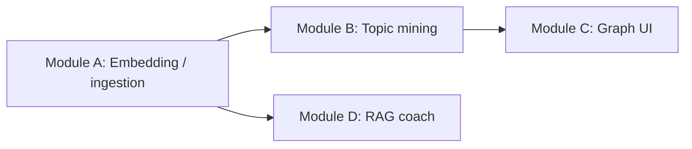

# CS510 Project Plan: Module Ownership & Task Division

**Course deliverable:** Interactive Knowledge Graph and AI Learning Agent for DevDecks (MERN + AI extension)

**Team:** Yu Wang (`yuw18`), Yun-Yun Tsai (`yunyunt2`), Katsuya Sakamoto (`katsuya3`), Ameya Kolhatkar (`aak15`)

**Project coordinator:** Ameya Kolhatkar (`aak15`)

This document divides work into **four end-to-end modules** so each teammate has **full ownership** of one vertical slice: requirements, design, implementation, testing, and demo narrative for that slice. Cross-module dependencies are explicit so integration stays predictable.

---

## 1. Guiding principles

- **One owner per module.** Others may submit small PRs into your area, but you approve scope and quality for your module.
- **Contracts over coupling.** Modules meet at stable APIs and shared data fields (see §5). Avoid hidden dependencies through informal globals or ad hoc fields.
- **Demo-ready incrementally.** Each module should be demonstrable on its own by the milestone dates, even if stubbed at boundaries.
- **Security and grounding are shared standards** (sanitization before LLM context, citation discipline, no silent web hallucination). Each owner applies them within their module; coordinator enforces consistency at integration reviews.

---

## 2. The four modules (product slices)

### Module A — Content embedding & ingestion pipeline (“Flashcard → vectors”)

**Outcome:** User-created cards, decks, and documents are **chunked**, **embedded**, and **indexed** so downstream features retrieve consistent, versioned evidence.

**Typical scope**

- Chunking strategy (card-level and sub-card chunks), deterministic IDs, embedding version stamps.
- Batch and incremental (re)indexing paths; backfill of existing decks.
- Storage contract for vectors/chunks on the platform side (aligned with your Mongo/Flashcard model and any vector DB if adopted later).
- Observability: counts indexed, failures, latency; safe retries.

**Touches (examples)**

- Ingestion triggers: new/updated flashcards, optional document uploads.
- API surface such as reindex/batch embedding (your roadmap already anticipates a semantic reindex path).

**Demo story**

- “We uploaded/edited content; within minutes it is searchable semantically and appears in tutor citations with stable chunk IDs.”

---

### Module B — Topic mining engine

**Outcome:** The system **extracts topics/labels** from content and **infers relationships** (e.g., co-occurrence, similarity-based edges) to bootstrap structure without manual graph building.

**Typical scope**

- Topic extraction from chunks/cards; confidence and normalization (avoid explosion of near-duplicate labels).
- Graph construction logic: nodes, weighted edges, optional direction for “prerequisite-like” scaffolding.
- Tuning: minimum confidence, limits, deduplication across cards.
- API that returns a **lightweight graph** for UI and for other services (graph panel, future recommendations).

**Demo story**

- “From the same corpus, we surface recurring themes and links between cards/decks the user did not manually connect.”

---

### Module C — Knowledge graph experience (visualization & exploration)

**Outcome:** Learners **see and explore** relationships among concepts and resources (React Flow, D3, or similar), grounded in data from Module B (and retrieval context where relevant).

**Typical scope**

- UX: pan/zoom, node detail, filtering, legend, empty/error states, performance on medium-sized graphs.
- Mapping from engine output to visual elements; optional clustering/layout.
- Integration with DevDecks navigation (deck/card deep links).
- Accessibility basics: keyboard focus, readable contrast, not relying on color alone.

**Demo story**

- “Here is our corpus visualized as a graph; clicking a node/card shows where it lives in the course material.”

---

### Module D — RAG learning coach (retrieval + grounded generation + pedagogy)

**Outcome:** A **context-aware tutor** that retrieves from **user/platform content**, cites evidence, and follows **Socratic / learning-science** behavior (hints, mnemonics, associations—not just raw answers).

**Typical scope**

- Retrieval: hybrid or semantic search over embedded chunks/cards; top-k and deduplication policy.
- Generation: prompts, system instructions, guardrails (insufficient evidence, low confidence).
- Citations: explicit references to card/chunk IDs in the UI.
- Chat UX: threads, loading states, error handling; optional user-editable “learning style” or system prompt (within safety constraints).

**Demo story**

- “Ask a course question; the tutor answers from our decks/docs with citations and guided questions.”

---

## 3. Suggested ownership (one person per module)

You may swap names; this mapping balances **stated backgrounds** and **minimizes blocking** on the critical path (embeddings first).

| Module | Suggested owner | Rationale |
|--------|-----------------|-----------|
| **A — Embedding & ingestion** | **Ameya Kolhatkar** | Fits coordinator + “integration with existing project” role; establishes contracts everyone else depends on. |
| **B — Topic mining engine** | **Yun-Yun Tsai** | Aligns with backend/data processing and graph *construction* logic. |
| **C — Knowledge graph UI** | **Yu Wang** | Aligns with frontend for graph + prior chat UI collaboration at integration time. |
| **D — RAG learning coach** | **Katsuya Sakamoto** | Carries search/retrieval and user-visible tutor value; pairs naturally with evaluation of usefulness (§7). |

**If you prefer Ameya on a different module:** keep **Module A** with whoever owns platform integration and Mongo/ingest contracts, or accept that embedding indexing may become a bottleneck for the whole team.

---

## 4. Dependencies (order matters)

- **A → B:** Topic mining consumes chunk/card text and embeddings (or derived features).
- **A → D:** RAG retrieves over embedded chunks; versioning and chunk IDs must be stable.
- **B → C:** Graph visualization consumes the mined graph (or a agreed projection of it).

**Parallelism:** After A exposes a minimal indexed corpus, **B** and **D** can progress in parallel. **C** can use **mock graph JSON** until B is ready.

---

## 5. Integration contracts (what each module “owns” vs. shares)

Align these with your implementation spec (e.g., semantic reindex, RAG tutor, topic-mine endpoints, Flashcard fields for `semanticChunks`, `topicNodes`, embeddings).

| Contract topic | Owner leads | Others consume |
|----------------|-------------|------------------|
| Chunk schema, `embeddingVersion`, reindex behavior | A | B, D |
| Retrieval modes and ranking defaults | D (with input from A on vector fields) | C (optional: “show why this node was retrieved”) |
| Topic node/edge JSON shape and confidence rules | B | C |
| Citation format in tutor responses | D | C (if displaying citations near graph) |
| Graph layout performance budgets | C | B (may simplify or cap nodes/edges) |

**Integration checkpoints (short, recurring)**

- **T+0:** A defines sample indexed documents and chunk IDs.
- **T+1:** B publishes sample `{ nodes, edges }` for one deck.
- **T+2:** D shows one end-to-end Q&A with real citations.
- **T+3:** C loads B’s graph for the same deck without manual edits.

---

## 6. Milestone schedule (aligned with your proposal)

Dates are **targets**; adjust in team chat, but keep **relative ordering** (A before B/D; B before full C).

| Target date | Milestone | Module focus |
|-------------|-----------|----------------|
| **Apr 10** | Indexed corpus MVP | **A:** ingestion + reindex path + stable chunk IDs; **D:** can stub retrieval on sample data. **B:** stub topic extraction on plain text. |
| **Apr 15** | Topic graph + visualization alpha | **B:** graph JSON from real cards; **C:** first React Flow/D3 view + navigation. |
| **Apr 20** | RAG tutor beta | **D:** hybrid retrieval + grounded answers + citations + Socratic system prompt. |
| **Apr 30** | Scale & deployment hardening | **A:** async jobs, caching, failure handling; **Coordinator:** env config, monitoring; **D:** latency-aware retrieval. **Katsuya (if owning D):** lead eval harness (§7). |
| **By May 9** | Demo + feedback | Full vertical demo; lightweight user survey; optional analytics on usage. |

---

## 7. Evaluation & scaling (recommended split)

**Primary:** **Module D owner** leads **utility evaluation** (rubric: groundedness, citation correctness, helpfulness of Socratic behavior), supported by others feeding test decks.

**Shared minimum bar**

- **Grounding:** Answers must cite platform chunks; “insufficient evidence” when retrieval is weak.
- **Safety:** Sanitize user text before model context; document what is never sent externally.

**Optional (time permitting)**

- LLM-as-judge on retrieval precision; session metrics (queries per session, return rate).

---

## 8. Per-module checklist (share with owners)

### Module A — Embedding & ingestion

- [ ] Define chunking rules and max sizes; document edge cases (empty cards, images, math).
- [ ] Implement/version `embeddingVersion` and migration story.
- [ ] Reindex API or job; progress and error reporting.
- [ ] Hand sample corpus + IDs to B and D.

### Module B — Topic mining

- [ ] Define topic normalization and confidence thresholds.
- [ ] Emit graph JSON used by C; version if shape changes.
- [ ] Document limitations (synonyms, noisy tags).

### Module C — Knowledge graph UI

- [ ] Load graph from B; loading/error/empty states.
- [ ] Deep link to cards/decks; readable labels.
- [ ] Performance: cap nodes/edges or level-of-detail if needed.

### Module D — RAG coach

- [ ] Retrieval pipeline with hybrid/semantic options aligned to A’s fields.
- [ ] Prompts: Socratic behavior, mnemonics/associations when appropriate.
- [ ] UI: show citations; handle failure modes gracefully.

---

## 9. Coordinator responsibilities (Ameya)

- **Unblock integration:** weekly 30-minute sync on API contracts and demo script.
- **Single changelog entry** per milestone for “what we proved in class.”
- **Risk watchlist:** embedding cost/latency, graph size in browser, prompt injection—assign mitigation owners.

---

## 10. Optional fifth thread (only if scope allows)

**Resource discovery / external search agent** (NotebookLM-style) is **explicitly out of the four core modules**. If bandwidth appears after Apr 20, the team may spawn a **stretch goal** owned by one person with a **narrow MVP** (e.g., curated links + summarization with strict allowlist domains). Do not let this dilute the four-module ownership without team agreement.

---

## 11. One-page summary for stakeholders

| Module | Owner (suggested) | User-visible outcome |
|--------|-------------------|----------------------|
| A — Embedding & ingestion | Ameya | All study content is machine-readable and retrievable with versioned chunks. |
| B — Topic mining | Yun-Yun | Automatic topics and relationships across cards/decks. |
| C — Knowledge graph UI | Yu | Explorable concept map tied to real materials. |
| D — RAG learning coach | Katsuya | Grounded, pedagogical Q&A with citations from your corpus. |

Together, these four modules realize the proposal: **automated structure**, **visible connections**, and **personalized tutoring** on top of DevDecks—without requiring learners to manually build a knowledge graph from scratch.
